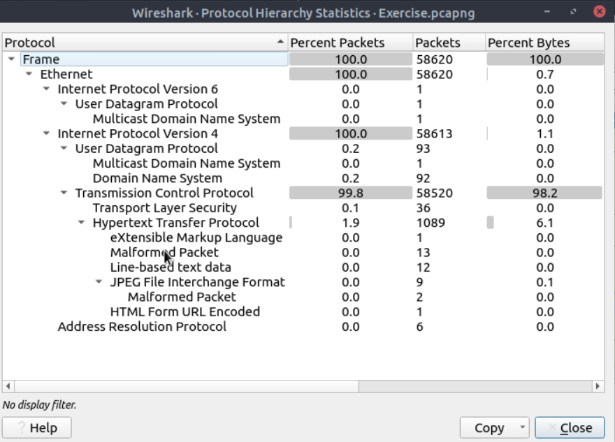
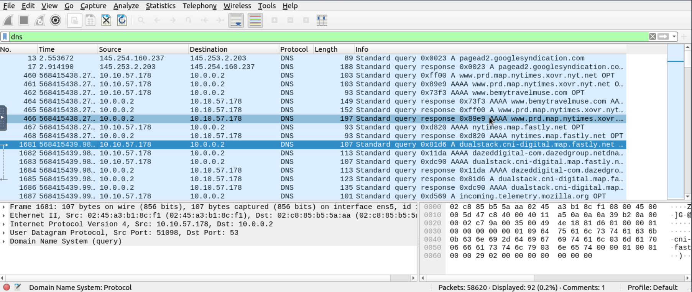

# Traffic Analysis Example – Wireshark

## Objective
Analyze a network capture to identify normal traffic patterns and look for potentially suspicious behavior using basic Wireshark techniques.

## Environment
- Tool: Wireshark
- Capture file: sample-capture.pcapng
- Perspective: SOC Level 1 / Blue Team (defensive)

## Initial Observations
After opening the capture file, I reviewed the overall traffic using:
- Statistics → Protocol Hierarchy
- Statistics → Conversations

This provided a high-level overview of the protocols and communication patterns present in the capture.

## Filters Used
To focus the analysis, I applied the following display filters:

- DNS traffic:

- HTTP traffic:

These filters helped isolate common protocols and reduce noise.

## Findings
- DNS queries appeared consistent with normal name resolution activity
- HTTP traffic included standard request and response patterns
- No obvious signs of malformed packets or protocol abuse were observed
- No unusual destination ports or unexpected protocols were identified during this review

## SOC Perspective
This type of initial traffic review is useful for:
- Establishing a baseline of normal network behavior
- Quickly identifying anomalies during incident investigations
- Supporting alert validation and triage in a SOC environment

## Next Steps
For deeper analysis, future steps could include:
- Comparing traffic against known malicious indicators
- Inspecting payloads where appropriate
- Correlating network activity with host-based logs

## Notes
This analysis was performed for learning and defensive purposes as part of SOC Level 1 training.
### Protocol Overview

### DNS Traffic

