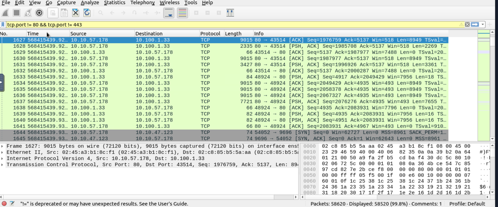

# Traffic Analysis Example – Identifying Suspicious Patterns

## Objective
Review network traffic to identify potential indicators of suspicious or abnormal behavior using basic Wireshark analysis techniques.

## Environment
- Tool: Wireshark
- Capture file: sample-capture.pcapng
- Perspective: SOC Level 1 / Blue Team (defensive)

## Analysis Approach
The analysis started with a high-level review to understand general traffic behavior, followed by focused inspection of specific patterns that may indicate suspicious activity.

## Initial Review
The following Wireshark features were used:
- Statistics → Protocol Hierarchy
- Statistics → Conversations
- Statistics → Endpoints

This helped identify:
- frequently communicating hosts
- dominant protocols
- unusual communication patterns

## Indicators Reviewed
During the analysis, attention was given to the following indicators:

- Repeated connection attempts
- Unusual destination ports
- Unexpected protocols for the environment
- High volume of traffic between specific hosts

## Filters Used
To narrow the analysis, these display filters were applied:

- Suspicious TCP activity:
tcp.flags.syn == 1 && tcp.flags.ack == 0

- Traffic to uncommon ports:

tcp.port != 80 && tcp.port != 443

- General TCP traffic:

## Findings
- Some repeated SYN packets were observed, which may indicate scanning or connectivity issues
- Traffic to non-standard ports was identified and would require further validation
- No clear evidence of active exploitation was confirmed during this review

## SOC Perspective
At the SOC Level 1 stage, these observations would typically be:
- documented
- correlated with alerts or logs
- escalated to Tier 2 if confirmed as suspicious

This highlights the importance of not over-concluding without sufficient evidence.

## Next Steps
Recommended follow-up actions include:
- Checking firewall or IDS/IPS logs
- Correlating traffic with endpoint activity
- Comparing findings against known threat intelligence

## Notes
This analysis was conducted for learning and defensive purposes as part of SOC Level 1 training.
### SYN Packet Review

### Non-Standard Ports

